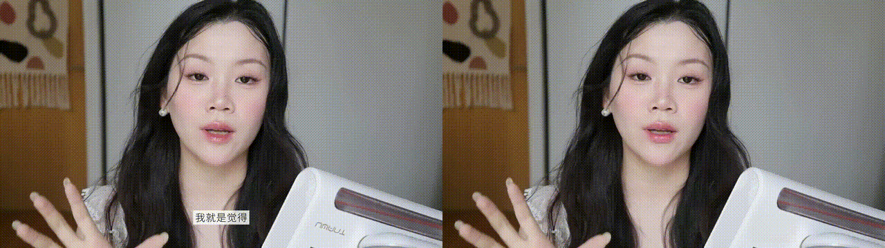
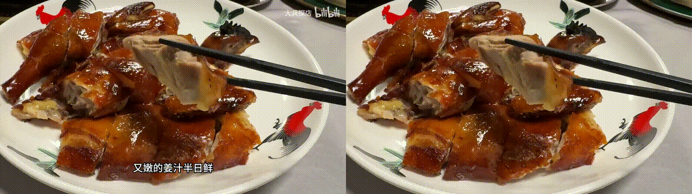
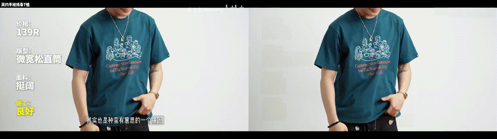
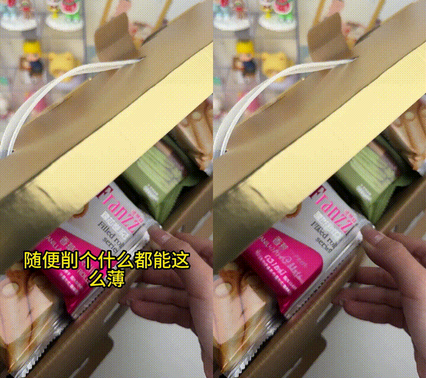
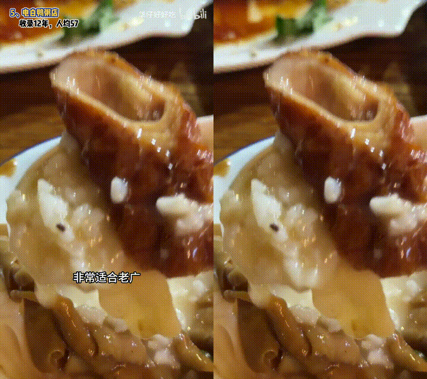
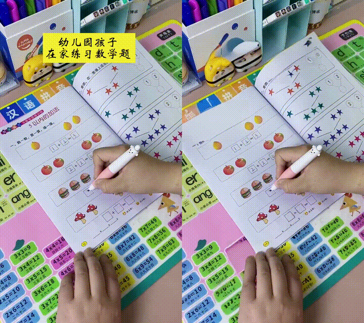
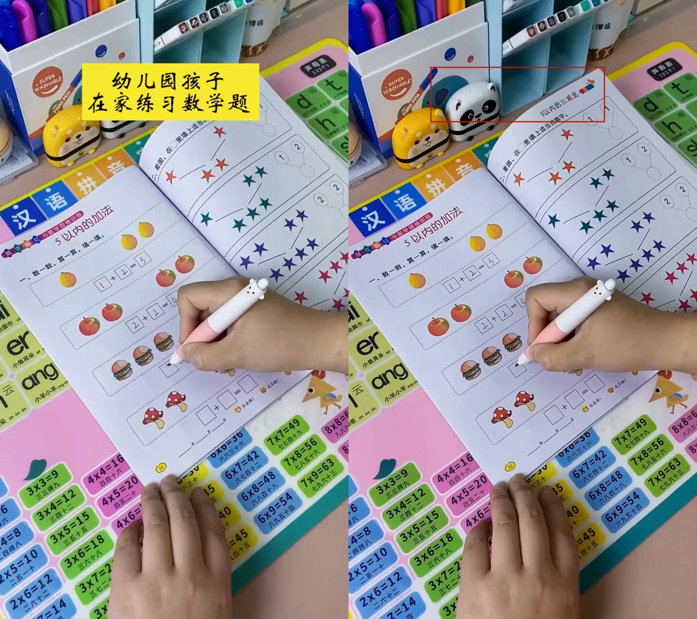

# Video-Auto-Detext

自动分析后期添加字幕（含背景框），自动过滤掉背景自带文字（课本字、包装字、招牌字等），基于diffueraser擦除后期字幕（含背景框）。

---

# 直出运行效果


#### 测试素材收集自短视频平台，仅作实际场景下效果测试。测试素材不随仓库公开，请自备测试数据。

<p align="center">






</p>

#### 评论区反馈需求和问题，我来做进一步优化~

---


# 安装配置

## 1. 安装

```bash
conda create -n detext python=3.12 -y
conda activate detext
pip install -r requirements.txt
sudo apt install ffmpeg
```

## 2. 下载模型

**各模型的下载命令见 `models/download_model.md`。**

下载后 `models/` 的最终结构，共约 14 G：

```
models/                                  合计约 14 G
├── ppocr_det/
│   └── ch_PP-OCRv4_det_infer/           PP-OCRv4 DB 检测模型              4.7 M
├── diffuEraser/
│   ├── brushnet/                        DiffuEraser 主权重（BrushNet 分支）  3.4 G
│   └── unet_main/                       DiffuEraser 主权重（时序 UNet）      4.9 G
├── stable-diffusion-v1-5/               SD1.5 底座                        4.8 G
├── sd-vae-ft-mse/                       独立 VAE                          639 M
├── PCM_Weights/
│   └── sd15/                            PCM LoRA（2-Step）                129 M
└── propainter/                          ProPainter 先验                   191 M
    ├── ProPainter.pth                   151 M
    ├── raft-things.pth                  21 M
    └── recurrent_flow_completion.pth    20 M
```

## 3. 主要命令

### 3.1 处理单个视频

```bash
python run.py -i <视频文件>
```

产物：

```
outputs/mask_result/<名字>.<ext>     字幕掩码
outputs/final_result/<名字>.<ext>    擦除后的成品
```


### 3.2 处理整个文件夹

```bash
python run.py -i <目录>                     # 目录下所有视频
python run.py -i <目录> --jobs 2            # 掩码阶段并行 2 个进程
python run.py -i <目录> --only a,b,c        # 只处理这几支（文件名去掉扩展名）
```


### 3.3 多种设置

**保存成左右对照视频**

```bash
python run.py -i <输入> --compare
```


**只跑其中一个阶段**

```bash
python run.py -i <输入> --stage mask      # 只出 mask_result/
python run.py -i <输入> --stage erase     # 掩码 + 擦除
python run.py -i <输入> --stage all       # 同上（默认）
```

**换输出位置**

```bash
python run.py -i <输入> -o D:/out
```

**显存 / 内存吃紧**

```bash
python run.py -i <输入> --max-img-size 640     # 降模型工作分辨率，最直接的省显存手段
python run.py -i <输入> --max-px-frames 8e7    # 把段切碎，显存与内存峰值一起降
python run.py -i <输入> --ram-budget-gb 0.5    # 只限「一份」解码帧，实际峰值约为它的 5 倍
```

方屏素材（长边压不到 800 以下）的显存峰值最高，这类语料优先调 `--max-px-frames`。

**想更清晰**

```bash
python run.py -i <输入> --max-img-size 960     # 调大更清晰，显存也涨
```

**擦得更干净 / 更保守**

```bash
python run.py -i <输入> --mask-dilation 12     # 掩码再往外扩，字幕有残留时用
python run.py -i <输入> --no-bg                # 关掉背景判决，一律紧贴字幕
```

**换加速档位、固定随机种子**

```bash
python run.py -i <输入> --ckpt 4-Step
python run.py -i <输入> --seed 42              # 同一视频可复现（默认每次随机）
```

**只跑掩码时换检测设备**

```bash
python run.py -i <输入> --stage mask --device cpu
```

### 3.4 参数一览

输入输出：

| 参数 | 默认 | 说明 |
|---|---|---|
| `-i, --input` | 必填 | 视频文件，或装着视频的目录（目录 = 批量） |
| `-o, --out` | `outputs/` | 输出根目录。输入是目录时会再套一层 `<目录名>/` |
| `--stage` | `all` | `mask` 只出 `mask_result/`；`erase` 与 `all` 等价（掩码+擦除，都会产出两个目录） |
| `--compare` | 关 | 保存的两个视频改成「左原片 \| 右结果」的对照拼接 |
| `--only` | — | 只处理这些视频，逗号分隔的**文件名去扩展名**，精确匹配 |
| `--out-exact` | 关 | 把 `--out` 当成最终产物目录本身，不再套 `<目录名>/` |
| `--jobs` | 1 | 掩码阶段的并发进程数。擦除阶段显存独占，**始终串行** |


掩码阶段：

| 参数 | 默认 | 说明 |
|---|---|---|
| `--max-long-side` | 1920 | 检测前长边封顶。**别低于 1280**，否则小字会漏 |
| `--device` | `auto` | `auto` / `gpu` / `cpu` |
| `--no-bg` | 关 | 关掉背景判决，一律走紧贴模式 |
| `--no-sticky` | 关 | 关掉轨迹级粘住，逐帧独立出判决 |
| `--no-static` | 关 | 关掉静态外观剔除，退回「只走时域判据」 |
| `--no-tilt` | 关 | 关掉倾角剔除（斜排文字判为画面原生文字） |
| `--no-panel` | 关 | 关掉静帧面板剔除（证书/销量牌/商品图里的字判为画面原生文字） |
| `--no-occupy` | 关 | 关掉「全片驻留的屏幕叠加物」豁免（半透明水印/角标不再被救回来） |
| `--static-margin` | 0.0 | 静态判据的余量，越大越保守（少剔） |
| `--sticky-share` | 0.15 | 轨迹里判出带背景的帧占比达此值就整条粘住；≥2 等于关掉 |
| `--mask-crf` | 0 | 掩码的 x264 CRF。0 = 逐位无损（配合 `gray` 编码） |
| `--preset` | medium | x264 preset |
| `--x264-threads` | 4 | x264 线程数 |


擦除阶段：

| 参数 | 默认 | 说明 |
|---|---|---|
| `--ckpt` | `2-Step` | PCM 加速档位，共 8 档（4/8/16-Step、Normal CFG、LCM-Like LoRA） |
| `--max-img-size` | 800 | 模型工作分辨率上限（长边）。调大更清晰也越吃显存 |
| `--mask-dilation` | 8 | 掩码膨胀次数。调大擦得更宽，掩码偏紧时用来补边 |
| `--long-side` | 960 | 预处理降采样长边。≥ `--max-img-size` 就不损失细节，纯省内存 |
| `--max-px-frames` | 1.5e8 | 单段的「帧数 × 模型工作像素」预算，**决定显存与内存峰值的主旋钮** |
| `--ram-budget-gb` | 1.5 | 单段解码帧内存上限，真实峰值约为它的 5 倍 |
| `--crf` | 0 | 成品的 x264 CRF。0 = 无损；调大（如 12）体积约降到 1/12，视觉上无可辨差别 |
| `--guidance-scale` | 档位自带 | 扩散引导强度 |
| `--seed` | 无 | 固定噪声种子；不给则每次随机 |
| `--ref-stride` | 10 | ProPainter 参数 |
| `--neighbor-length` | 10 | ProPainter 参数 |
| `--subvideo-length` | 50 | ProPainter 参数 |

全部参数以 `python run.py --help` 为准；`python run.py --version` 看版本号。


---

# License

This repository uses [Propainter](https://github.com/sczhou/ProPainter) as the prior model. Users must comply with [Propainter's license](https://github.com/sczhou/ProPainter/blob/main/LICENSE) when using this code. Or you can use other model to replace it.

This project is licensed under the [Apache License Version 2.0](./LICENSE) except for the third-party components listed below.

# Acknowledgement

This code is based on [DiffuEraser](https://github.com/lixiaowen-xw/DiffuEraser), [BrushNet](https://github.com/TencentARC/BrushNet), [Propainter](https://github.com/sczhou/ProPainter) and [Animatediff](https://github.com/guoyww/AnimateDiff).

---

# 其他内容

### Minimax-H3版本字幕擦除（未开源）
<p align="center">

</p>
Minimax-H3是现阶段生成内容比较细致的模型，能实现内容的推理+细节的补全。

### 欢迎技术交流

如果您对于做创新的AI应用有兴趣，欢迎来交流！如果是做传统的已有功能开发/API/服务，请不要来找我了，感谢！

QQ：312863063
